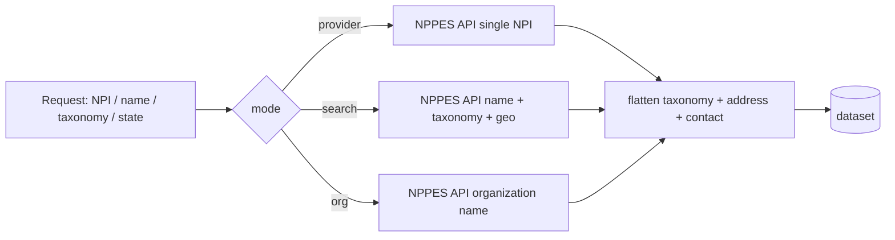

# NPI Provider Lookup API

NPI lookup API over the CMS NPPES registry. Give it an NPI number, a name, a taxonomy, or a city/state and you get back flat, normalized US healthcare provider records. No key. No raw NPPES nesting to untangle. Runs as a standby HTTP API for single lookups and as a batch actor for big pulls.

[](https://apify.com/george.the.developer/npi-provider-lookup?fpr=bbquoh?source=github-npi)
[](https://apify.com/george.the.developer/npi-provider-lookup?fpr=bbquoh?source=github-npi)
[](https://apify.com/george.the.developer/npi-provider-lookup?fpr=bbquoh?source=github-npi)
[](https://npiregistry.cms.hhs.gov/)
[](LICENSE)

This repo is the docs and example payloads. The actor itself lives on Apify Store: **[george.the.developer/npi-provider-lookup](https://apify.com/george.the.developer/npi-provider-lookup?fpr=bbquoh?source=github-npi)**.

---

## What it does

It wraps the public CMS NPPES registry and hands back clean records. Four things it covers:

- **Single NPI lookup.** Pass a 10 digit NPI and get the full provider record back, already flattened. No digging through nested address and taxonomy arrays.
- **Name / taxonomy / geo search.** Search by first name, last name, taxonomy description (specialty), city, and state. Build a list of every neonatal nurse practitioner in California, or every cardiologist in Houston, that kind of thing.
- **Organization search.** NPI-2 entities (hospitals, clinics, group practices, labs) by organization name plus location. Same flat shape as individual providers.
- **Normalized flat output.** Every record comes out as one flat object. Primary taxonomy pulled up to top level, location address and mailing address split into named fields, phone and fax extracted. You write `record.primary_taxonomy_desc`, not `record.taxonomies.find(t => t.primary).desc`.

It is a thin, honest layer. The data is whatever NPPES has. The value is that you stop writing the same flattening code for the fifth time.

## Why

The raw NPPES API is free and public, which is great, but it has sharp edges that everyone hits:

- It caps results. You ask for a big specialty in a big state and you page through it 200 at a time, or you bump into the hard ceiling and miss records.
- It returns deeply nested blobs. Taxonomies are an array where you have to scan for `primary: true`. Addresses are an array you filter by `address_purpose`. Phone and fax live inside those address objects. Every team that touches this writes the same normalization pass.
- It does not make active vs deactivated obvious in a way you can sort or filter cheaply across a batch.

So teams keep rebuilding the same three things: normalization, batching/pagination, and an active/deactivated check. This actor does those once so you do not have to. You point it at a query, you get flat rows in a dataset, done.

## How it works



The request picks a mode, the actor calls the NPPES registry for that mode, the response gets flattened (primary taxonomy lifted up, location and mailing addresses split out, phone/fax pulled), and rows land in the dataset. Standby mode returns the flat JSON directly over HTTP for single lookups.

## Endpoints

Standby HTTP API. Base URL is your standby actor URL. All endpoints are GET.

| Endpoint | Params | What it returns |
| --- | --- | --- |
| `GET /provider` | `npi` (10 digits, required) | One flat provider record |
| `GET /search` | `first_name`, `last_name`, `taxonomy`, `city`, `state`, `limit` | Array of flat provider records |
| `GET /org` | `org_name`, `city`, `state`, `limit` | Array of flat organization records |

Notes:

- `state` is a two letter code (`CA`, `TX`, `NY`).
- `taxonomy` matches against the taxonomy description, so `Nurse Practitioner` or `Cardiology` work.
- `limit` defaults to a sane page size. The batch actor handles pagination past the NPPES cap for you.

You can also run it as a normal Apify actor with a JSON input (see [examples/](examples/)) when you want a dataset instead of an HTTP response.

### When to use standby vs batch

- **Standby (HTTP).** One lookup, low latency, you want the answer inline in your app. Validate an NPI on a claim, confirm a single provider during onboarding, enrich one record on a form submit.
- **Batch (actor run).** A list. A whole specialty in a state, a file of NPIs to re-check, a territory build for sales. The run paginates past the NPPES cap and writes flat rows to a dataset you pull once.

## Output schema

Every record, individual or organization, comes out in this flat shape. Fields that do not apply to a given entity are omitted or null.

| Field | Type | Description |
| --- | --- | --- |
| `npi` | string | 10 digit National Provider Identifier |
| `enumeration_type` | string | `NPI-1` (individual) or `NPI-2` (organization) |
| `entity` | string | `individual` or `organization` |
| `status` | string | `A` active, deactivated providers flagged |
| `name_prefix` | string | Prefix for individuals (Mr., Mrs., Dr.) |
| `first_name` | string | First name (individual) |
| `middle_name` | string | Middle name (individual) |
| `last_name` | string | Last name (individual) |
| `credential` | string | Credentials such as RN, MD, NNP |
| `organization_name` | string | Legal business name (organization) |
| `sex` | string | `M` or `F` (individual) |
| `sole_proprietor` | string | `YES` / `NO` (individual) |
| `enumeration_date` | string | Date the NPI was assigned |
| `last_updated` | string | Last NPPES update date |
| `certification_date` | string | Certification date when present |
| `primary_taxonomy_code` | string | Primary taxonomy code (specialty code) |
| `primary_taxonomy_desc` | string | Primary taxonomy description (specialty) |
| `primary_taxonomy_license` | string | License number tied to primary taxonomy |
| `primary_taxonomy_state` | string | License state for primary taxonomy |
| `taxonomies` | array | All taxonomies (code, desc, license, primary, state) |
| `location_address_1` | string | Practice location street |
| `location_city` | string | Practice location city |
| `location_state` | string | Practice location state |
| `location_postal_code` | string | Practice location ZIP |
| `location_phone` | string | Practice location phone |
| `location_fax` | string | Practice location fax |
| `mailing_address_1` | string | Mailing street |
| `mailing_city` | string | Mailing city |
| `mailing_state` | string | Mailing state |
| `mailing_postal_code` | string | Mailing ZIP |
| `mailing_phone` | string | Mailing phone |
| `mailing_fax` | string | Mailing fax |
| `other_names` | array | Former / professional / former names |

## Quick start

### cURL (standby)

```bash
# single NPI lookup
curl "https://<your-standby-url>/provider?npi=1104130236"

# search by name + taxonomy + state
curl "https://<your-standby-url>/search?last_name=smith&state=CA&taxonomy=Nurse%20Practitioner&limit=50"

# organization search
curl "https://<your-standby-url>/org?org_name=childrens%20hospital&state=CA"
```

### Node.js (apify-client)

```js
import { ApifyClient } from 'apify-client';

const client = new ApifyClient({ token: process.env.APIFY_TOKEN });

const run = await client.actor('george.the.developer/npi-provider-lookup').call({
  mode: 'search',
  lastName: 'smith',
  state: 'CA',
  taxonomyDescription: 'Nurse Practitioner',
  limit: 50,
});

const { items } = await client.dataset(run.defaultDatasetId).listItems();
console.log(items[0].primary_taxonomy_desc);
```

### Python (apify-client)

```python
from apify_client import ApifyClient
import os

client = ApifyClient(os.environ["APIFY_TOKEN"])

run = client.actor("george.the.developer/npi-provider-lookup").call(run_input={
    "mode": "provider",
    "npi": "1104130236",
})

for item in client.dataset(run["defaultDatasetId"]).iterate_items():
    print(item["primary_taxonomy_desc"], item["location_state"])
```

## Examples

Sample inputs and a real trimmed output record live in [examples/](examples/):

- [`input-search.json`](examples/input-search.json): name + taxonomy + state search input
- [`input-provider.json`](examples/input-provider.json): single NPI lookup input
- [`sample-provider.json`](examples/sample-provider.json): a real flattened provider record

Here is what one flattened record looks like (real NPPES data, public CMS directory):

```json
{
  "npi": "1104130236",
  "enumeration_type": "NPI-1",
  "entity": "individual",
  "status": "A",
  "first_name": "SHELLEY",
  "last_name": "AKEY",
  "credential": "RN, NNP",
  "primary_taxonomy_code": "363LN0000X",
  "primary_taxonomy_desc": "Nurse Practitioner, Neonatal",
  "primary_taxonomy_state": "AZ",
  "location_address_1": "1919 E THOMAS RD",
  "location_city": "PHOENIX",
  "location_state": "AZ",
  "location_postal_code": "850167710",
  "location_phone": "602-933-6345"
}
```

The raw NPPES response for that same provider is a nested blob with a `taxonomies` array you scan for `primary: true` and an `addresses` array you filter by purpose. The flat shape above is what you actually want to work with.

## Pricing

Pay per event. You pay for what you pull, nothing on idle.

| Event | Price |
| --- | --- |
| Actor start | $0.25 |
| Provider record | $0.01 |
| Enriched provider | $0.02 |

A provider record is one flattened row. An enriched provider includes the full taxonomy list and both address blocks expanded. PPE pricing activates on **2026-06-24**.

## Use cases

**Healthcare RCM and billing.** Revenue cycle and medical billing SaaS validate the rendering and billing NPI on every claim before it goes out. Pulling the registry record inline catches a wrong or deactivated NPI before the payer rejects the claim and the work order bounces back.

**Credentialing.** Credentialing teams and platforms confirm a provider's NPI, taxonomy, and license state match the application on file. The flat taxonomy and license fields make the cross check a field comparison instead of a parse job.

**Payers validating NPIs.** Health plans and clearinghouses check that submitted NPIs are real, active, and carry the expected specialty before they process. Batch mode lets them run a whole file of NPIs through in one pull and flag the deactivated or mismatched ones.

**Health-tech lead generation.** Health-tech and SaaS sales teams build targeted provider lists by specialty and geography for outreach. Search by taxonomy plus state gives you, for example, every endocrinologist in Florida as flat rows ready to load into a CRM.

**Pharma field sales.** Pharma reps and field-sales ops build call lists scoped to the specialty their drug targets in a given territory. Taxonomy plus state plus city narrows it to the prescribers that actually matter for that line.

**Healthcare recruiters.** Recruiters and staffing platforms source clinicians by specialty and location and confirm credentials before reaching out. The registry gives you name, credential, taxonomy, and practice location in one record so the first contact is informed.

## FAQ

**How do I look up an NPI number?**
Pass the 10 digit NPI to the `/provider` endpoint (or `mode: provider` in the actor input). You get back the full flattened record: name, credential, primary taxonomy, practice and mailing addresses, phone, and active status. No key needed.

**Is NPPES data free?**
Yes. NPPES is the public CMS provider registry and the underlying data is free to use. This actor wraps that free data and charges only for the normalization, batching, and active/deactivated handling it does on top, so you do not rebuild it yourself.

**How do I search providers by specialty?**
Use the `taxonomy` param on `/search` with the specialty text, for example `Cardiology` or `Nurse Practitioner`, plus a `state`. That maps to the NPPES taxonomy description and returns every matching provider in that geography as flat rows.

**What is NPI taxonomy?**
Taxonomy is the standardized code that classifies a provider's specialty (for example `363LN0000X` for Neonatal Nurse Practitioner). A provider can hold several. This actor lifts the primary one to the top level and keeps the full list under `taxonomies` so you can filter on either.

**What is the difference between NPI-1 and NPI-2?**
NPI-1 is an individual provider (a person). NPI-2 is an organization (a hospital, clinic, group practice, or lab). Both come back in the same flat shape; `enumeration_type` and `entity` tell you which one you are looking at.

**Can I check if an NPI is deactivated?**
Yes. The `status` field carries the registry status and deactivated providers are flagged, so you can filter a batch down to the ones that no longer bill or that need to be replaced on file before you trust them.

## Privacy

NPI data is the public CMS provider directory published by federal law; no patient data is involved.

---

Built it because every healthcare data project I touched rebuilt the same NPPES flattening. Try it: **[NPI Provider Lookup on Apify Store](https://apify.com/george.the.developer/npi-provider-lookup?fpr=bbquoh?source=github-npi)**.

Keywords: NPI lookup API, NPPES API, healthcare provider lookup, NPI number search, provider taxonomy lookup, NPI registry API, physician NPI data, provider enrichment, healthcare provider data API.
